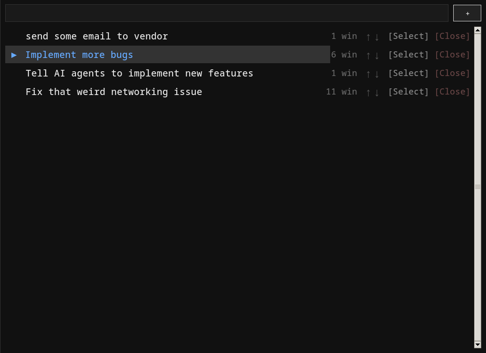

# taskwm - Task-Centric Workspaces for bspwm

A task-based workflow manager for bspwm that lets you organize your work into tasks, each with its own set of windows.



## Features

- **Task Picker** (Super+1): A dedicated desktop for managing tasks
- **Active Workspace** (Super+2): Your current task's windows
- **Window Swapping**: Seamlessly switch between tasks, windows follow automatically
- **Polybar Integration**: Shows current task with done/switch controls
- **CLI Interface**: Short commands for scripting and quick actions

## Dependencies

**Required:**
- Python 3.x
- Tkinter (`tk` package on Arch)
- bspwm / bspc
- xdotool (for window ID detection)
- polybar (for status bar integration)

**Optional:**
- xprop (for WM_CLASS inspection)

### Installing on Arch Linux

```sh
sudo pacman -S python tk bspwm xdotool polybar
```

## Installation

1. Clone the repository:

```sh
git clone https://github.com/magik6k/taskwm ~/src/taskwm
```

2. Create symlinks in your PATH:

```sh
mkdir -p ~/.local/bin
ln -sf ~/src/taskwm/taskwm/bin/tw ~/.local/bin/tw
```

3. Ensure `~/.local/bin` is in your PATH (add to `~/.bashrc` or `~/.zshrc`):

```sh
export PATH="$HOME/.local/bin:$PATH"
```

## Configuration

### sxhkdrc

Add these keybindings to your `~/.config/sxhkd/sxhkdrc`:

```sh
# Task workspaces
super + 1
    bspc desktop -f tasks

super + 2
    bspc desktop -f active

# Legacy numeric desktops
super + {0,3,4,5,6,7,8,9}
    bspc desktop -f {0,3,4,5,6,7,8,9}

# Move window to desktop
super + shift + {0,1,2,3,4,5,6,7,8,9}
    bspc node -d {0,tasks,active,3,4,5,6,7,8,9}

# Quick done - close current task
super + shift + d
    tw d -f
```

### bspwmrc

Add to your `~/.config/bspwm/bspwmrc`:

```sh
# Start taskwm daemon (after sxhkd)
tw daemon &

# Rule for taskwm picker
bspc rule -a taskwm-picker desktop=tasks state=tiled
```

### Polybar

Add these modules to your polybar config:

```ini
[module/taskwm]
type = custom/script
interval = 1
exec = tw status -l 40
click-left = bspc desktop -f tasks
format-foreground = #7cafc2

[module/taskwm-done]
type = custom/menu
expand-right = true
label-open = " Done "
label-open-foreground = #e8e8e8
label-open-background = #333333
label-close = " Cancel "
label-separator = " "
menu-0-0 = "Confirm"
menu-0-0-foreground = #ff6666
menu-0-0-exec = tw d -f
```

Then add to your bar:
```ini
modules-center = taskwm-done taskwm
```

## Usage

### CLI Commands

```sh
tw a "title"     # Add a new task, prints ID
tw l             # List tasks (ID<tab>title)
tw l -a          # List all tasks including done
tw s <id>        # Select task (swap windows into active)
tw d             # Mark current task done (prompts if windows exist)
tw d -f          # Force done (closes windows)
tw r <id>        # Remove task
tw r <id> -f     # Force remove (closes windows)
tw cur           # Print current task ID
tw title         # Print current task title
tw status        # Print current task title (for polybar)
tw daemon        # Run the background daemon
```

### Workflow

1. **Start the daemon** (automatic if in bspwmrc):
   ```sh
   tw daemon &
   ```

2. **Create a task**:
   - Press Super+1 to go to the Tasks desktop
   - Type a task name and press Enter or click +
   - Or from CLI: `tw a "Fix bug #123"`

3. **Select a task**:
   - Click [Select] in the picker, or
   - Click the task name in polybar to go to picker, or
   - From CLI: `tw s 1`

4. **Work on your task**:
   - Press Super+2 to go to Active desktop
   - Open windows, they stay with your task
   - Switch tasks anytime - windows move automatically

5. **Complete a task**:
   - Click "Done" in polybar, then "Confirm", or
   - Click [Close] in the picker, or
   - From CLI: `tw d`

### Keyboard Shortcuts (in Picker)

| Key | Action |
|-----|--------|
| Up/Down | Navigate task list |
| Enter | Select highlighted task (or add if typing) |
| Delete / Ctrl+D | Close highlighted task |
| Ctrl+N | Focus input field |
| Escape | Clear input / deselect |

## File Locations

- **State**: `~/.local/state/taskwm/state.json`
- **Config**: `~/.config/taskwm/config.json`
- **PID files**: `~/.local/state/taskwm/*.pid`

## Configuration Options

```json
{
  "monitor": "DP-0",
  "theme": {
    "font": "monospace 10",
    "bg": "#111111",
    "fg": "#e6e6e6",
    "accent": "#66aaff",
    "button_bg": "#222222",
    "entry_bg": "#1a1a1a",
    "select_bg": "#333333",
    "border": "#333333"
  },
  "behavior": {
    "close_policy": "delete",
    "move_stray_on_tasks_to": "active"
  }
}
```

## Troubleshooting

### Check if daemon is running

```sh
ps aux | grep 'tw daemon'
cat ~/.local/state/taskwm/daemon.pid
```

### Restart the daemon

```sh
pkill -f 'taskwm'
tw daemon &
```

### View state

```sh
cat ~/.local/state/taskwm/state.json | python -m json.tool
```

### Reset state

```sh
rm ~/.local/state/taskwm/state.json
pkill -f 'taskwm'
tw daemon &
```

## Architecture

```
taskwm/
├── taskwm/
│   ├── __init__.py      # Package init
│   ├── __main__.py      # Module entry point
│   ├── cli.py           # CLI commands (tw)
│   ├── state.py         # State management (JSON)
│   ├── config.py        # Configuration handling
│   ├── bspwm.py         # bspwm interaction (bspc wrapper)
│   ├── daemon.py        # Background daemon
│   └── ui_picker.py     # Task picker UI (Tkinter)
└── bin/
    └── tw               # CLI wrapper script
```

## License

This program is free software; you can redistribute it and/or modify
it under the terms of the GNU General Public License as published by
the Free Software Foundation; either version 2 of the License, or
(at your option) any later version.

See [LICENSE](LICENSE) for full text.
